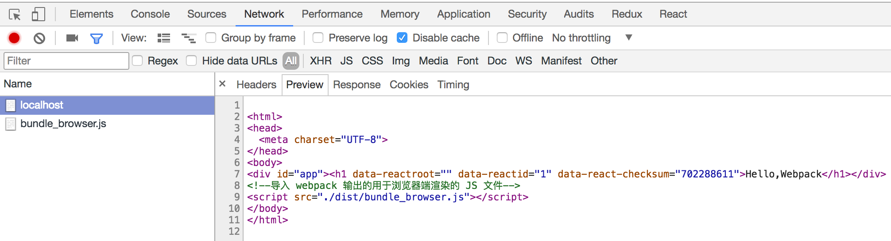

## 简介

服务器渲染就是由服务器生成html页面框架，由于 React & Vue 的核心是虚拟 DOM，所以使用它们通过 NodeJs可以方便的在服务器端生成 html 页面。

这就要求构建出两套代码，一套在服务器端运行，用于渲染出 html，另外一套在浏览器中运行。

同构应用指的就是从一份项目源码中构建出2份 JavaScript 代码，一份用于在浏览器端运行，一份用于在 NodeJs 环境中运行渲染出 HTML。

## 同构应用的注意事项

由于同构代码要在 NodeJs环境中运行，所以与浏览器中运行的 JavaScript是有区别的，需要注意以下几点：

* 不能包含浏览器环境提供的 API，例如使用 document 进行 DOM 操作， 　因为 Node.js 不支持这些 API；

* 不能包含 CSS 代码，因为服务端渲染的目的是渲染出 HTML 内容，渲染出 CSS 代码会增加额外的计算量，影响服务端渲染性能；

* 不能像用于浏览器环境的输出代码那样把 node_modules 里的第三方模块和 Node.js 原生模块(例如 fs 模块)打包进去，而是需要通过 CommonJS 规范去引入这些模块。

* 需要通过 CommonJS 规范导出一个渲染函数，以用于在 HTTP 服务器中去执行这个渲染函数，渲染出 HTML 内容返回。

## 构建服务端渲染代码的配置文件

*webpack_server.config.js*

```
const path = require('path');
const nodeExternals = require('webpack-node-externals');

module.exports = {
  // JS 执行入口文件
  entry: './main_server.js',
  // 为了不把 Node.js 内置的模块打包进输出文件中，例如 fs net 模块等
  target: 'node',
  // 为了不把 node_modules 目录下的第三方模块打包进输出文件中
  externals: [nodeExternals()],
  output: {
    // 为了以 CommonJS2 规范导出渲染函数，以给采用 Node.js 编写的 HTTP 服务调用
    libraryTarget: 'commonjs2',
    // 把最终可在 Node.js 中运行的代码输出到一个 bundle_server.js 文件
    filename: 'bundle_server.js',
    // 输出文件都放到 dist 目录下
    path: path.resolve(__dirname, './dist'),
  },
  module: {
    rules: [
      {
        test: /\.jsx?$/,
        use: ['babel-loader'],
        exclude: path.resolve(__dirname, 'node_modules'),
      },
      {
        // CSS 代码不能被打包进用于服务端的代码中去，忽略掉 CSS 文件
        test: /\.css|.scss$/,
        use: ['ignore-loader'],
      },
    ]
  },
  resolve: {
    // 先尝试 ts，tsx 后缀的 TypeScript 源码文件
    extensions: ['.ts', '.tsx', '.js', '.jsx']
  },
  devtool: 'source-map' // 输出 source-map 方便直接调试 ES6 源码
};

```

安装第三方依赖：

```
# 安装 Webpack 构建依赖
npm i -D ignore-loader webpack-node-externals
```

## 添加服务端渲染入口文件

*main_server.js*

```
import React from 'react';
import { renderToString } from 'react-dom/server';
import { AppComponent } from './AppComponent';

// 导出渲染函数，以给采用 Node.js 编写的 HTTP 服务器代码调用
export function render() {
  // 把根组件渲染成 HTML 字符串
  return renderToString(<AppComponent/>)
}
```

> 执行命令 webpack --config webpack_server.config.js 构建出用于服务端渲染的 ./dist/bundle_server.js 文件

## 添加用于浏览器端运行的入口文件

*main_browser.js*

```
import React from 'react';
import { render } from 'react-dom';
import { AppComponent } from './AppComponent';
import './main.scss';

// 把根组件渲染到 DOM 树上
render(<AppComponent/>, window.document.getElementById('app'));
```

> 执行命令 webpack 构建出用于浏览器环境运行的 ./dist/bundle_browser.js 文件，默认的配置文件为 webpack.config.js。

## 编写HTTP服务器

HTTP 服务器用于将 HTML发送到请求端

*http_server.js*

```
const express = require('express');
const { render } = require('./dist/bundle_server');
const app = express();

// 调用构建出的 bundle_server.js 中暴露出的渲染函数，再拼接下 HTML 模版，形成完整的 HTML 文件
app.get('/', function (req, res) {
  res.send(`
<html>
<head>
  <meta charset="UTF-8">
</head>
<body>
<div id="app">${render()}</div>
<!--导入 Webpack 输出的用于浏览器端渲染的 JS 文件-->
<script src="./dist/bundle_browser.js"></script>
</body>
</html>
  `);
});

// 其它请求路径返回对应的本地文件
app.use(express.static('.'));

app.listen(3000, function () {
  console.log('app listening on port 3000!')
});

```

安装 express

```
# 安装 HTTP 服务器依赖
npm i -S express
```

## 启动服务

> node ./http_server.js

访问*http://localhost:3000*查看页面，使用开发工具查看网络请求返回的结果，如下：



## 使用 npm scripts 优化命令

*package.json* 中添加如下内容

```
"scripts": {
  ...
  "clean": "rimraf dist/",
  "prebuild": "npm run clean",
  "build": "webpack --config webpack.config.js && webpack --config webpack_server.config.js",
  "start": "node ./http_server.js",
  ...
},
```

使用 * npm run build * & * npm run start* 就可以构建和发布就用了，是不是很方便？

你应该会发现服务器渲染的页面没有样式，因为它没有加载样式文件，下面我们来看看如何在服务器渲染的情况下添加样式


## 添加样式

### asset-manifest.json

asset-manifest.json 用于描述构建后各资源文件对应构建后的文件名，原因是构建后的文件可以带有 hash，文件名并不固定。

1. 安装 webpack-assets-manifest

> npm install webpack-assets-manifest --save-dev

2. 修改 webpack.config.js 添加 webpack-assets-manifest 插件

```
plugins: [
  ...
  new WebpackAssetsManifest({ // 生成 asset-manifest.json
    // Options go here
    output: 'asset-manifest.json' // 自定义名称
  }),
  ...
]
```

3. 生成asset-manifest.json

运行命令

```
npm run build
```

### 修改服务器代码 http_server.js ：

这里主要做两件事：

1. 引入上面生成的静态资源描述文件 * asset-manifest.json *

2. html模板中引入相关的 css & js


```
const express = require('express');
const { render } = require('./dist/bundle_server');
const app = express();
import buildPath from './dist/asset-manifest.json'; // 引入静态资源描述文件

// 调用构建出的 bundle_server.js 中暴露出的渲染函数，再拼接下 HTML 模版，形成完整的 HTML 文件
app.get('/', function (req, res) {
  res.send(`
    <html>
      <head>
        <meta charset="UTF-8">
        <link rel="stylesheet" type="text/css" href="/${buildPath['main.css']}">
      </head>
      <body>
        <div id="app">${render()}</div>
        <!--导入 Webpack 输出的用于浏览器端渲染的 JS 文件-->
        <script src="/${buildPath['main.js']}"></script>
      </body>
    </html>
  `);
});

// 静态文件目录
app.use(express.static('./dist'));

app.listen(3000, function () {
  console.log('app listening on port 3000!')
});
```

将html 中的静态资源路径全部映射到 buildPath 中

### 启动服务器

运行命令：

```
npm run start
```
